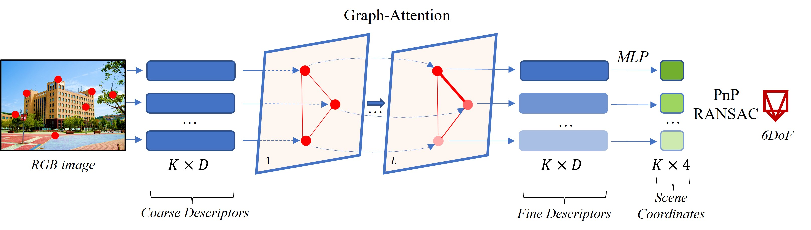
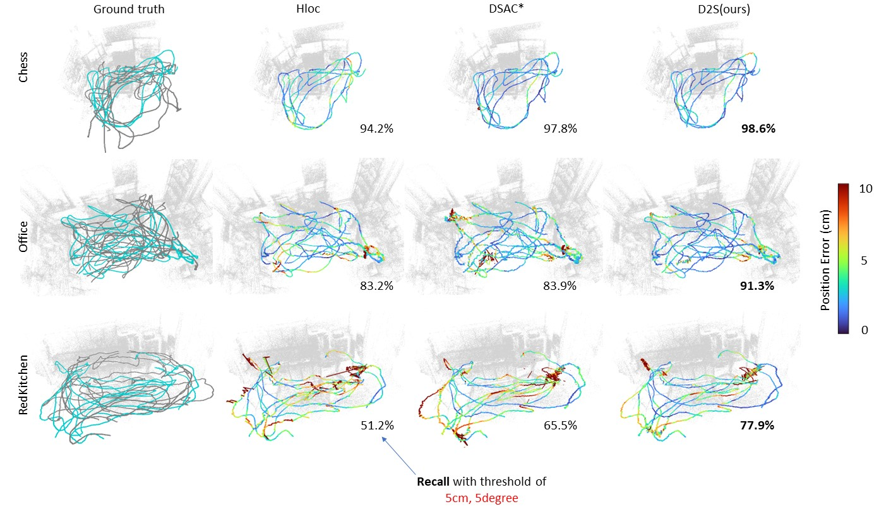
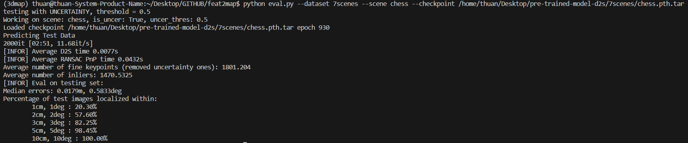

# Old version code of Representing sparse descriptors and scene coordinates for visual relocalization. 
Checkout enhanced implementation version here: [Project Page](https://thpjp.github.io/d2s/)

- [Introduction](#introduction)
- [Installation](#installation)
- [Dataset](#dataset)
    - [Supported Datasets](#supported-datasets)
    - [Data Preprocessing](#data-preprocessing)
- [Training & Evaluation](#training-&-evaluation)
    - [Pre-trained models](#pre-train-model) 
- [BibTex Citation](#bibTex-citation)

## Introduction  
D2S is a learning-based visual re-localization method. It concentrates on learning to generate 3D scene coordinates from sparse descriptors extracted from a single image. Once trained for a specific sparse SfM scene, D2S can accurately estimate the camera’s position and orientation from a new image of the scene. D2S also serves as a natural filter for outliers and non-robust descriptors, resulting in an enhanced localization accuracy down the line.

<p align="center">

<p>

<p align="center">

<p>

This repository contains the Pytorch implementation of our papers: 
- [D2S: Representing Local Descriptors and Global Scene Coordinates for Camera Relocalization](https://thpjp.github.io/d2s/)
- [Fast and Lightweight Scene Regressor for Camera Relocalization](https://arxiv.org/abs/2212.01830)

## Installation
D2S is based on PyTorch. The main framework is implemented in Python, including data processing and setting parameters.
D2S requires the following Python packages, and we tested it with the package versions in brackets.
```
pytorch (>=1.7.0)
opencv (4.7.0)
Pillow (9.4.0)
h5py (3.8.0)
visdom (0.2.4)
```
You can also install the environment using this command: 
```
conda env create -f environment.yml
```

D2S uses [hierarchical localization toolbox](https://github.com/cvg/Hierarchical-Localization)(hloc) to label descriptors coordinates. 
Please download this toolbox to third_party folder as follows:
 ```
feat2map
├── third_party
│   ├── Hierarchical_Localization
 ```
For the installation of hloc, you can use the same environment with D2S, just need to install some more Python packages that hloc requires. 
## Dataset 
### Supported Datasets
 - [7scenes](https://www.microsoft.com/en-us/research/project/rgb-d-dataset-7-scenes/)
 - [12scenes](http://graphics.stanford.edu/projects/reloc/)
 - [Indoor6](https://github.com/microsoft/SceneLandmarkLocalization)
 - [Cambridge Landmarks](http://mi.eng.cam.ac.uk/projects/relocalisation/#dataset)
 - [BKC Ritsumeikan](https://drive.google.com/file/d/1XEdnrFTzThruG15pW2A_1jYAxtpYbwq5/view?usp=sharing)
### Data Preprocessing
 1. You need to run the hloc pipeline to generate the SfM models for each dataset. For example, with 7scenes and Cambridge Landmarks datasets, you can simply run the code provided by hloc from these guides [7scenes pipeline](https://github.com/cvg/Hierarchical-Localization/tree/master/hloc/pipelines/7Scenes) and [Cambridge pipeline](https://github.com/cvg/Hierarchical-Localization/tree/master/hloc/pipelines/Cambridge). Note that D2S has been tested using a fixed 2048 SuperPoint descriptors per image, please configure this in hloc before execution to produce correct data. Since the rest datasets are not supported by hloc, we will provide the script to run the hloc on them later. Then, please create the folder and run the commands to generate SfM models as same as 7scenes and Cambridge.
 
 3. Now you can generate training and testing data using this script. Please config the dataset and scene name in the [preprocessing.py](https://github.com/ais-lab/feat2map/blob/main/processing/preprocessing.py) file before running this:
```shell
cd processing
python preprocessing.py --dataset_dir <path to dataset folder> --dataset <name of the dataset> --scene <name of the scene>
```
<details>
<summary><span style="font-weight: bold;">Command Line Arguments for preprocessing.py</span></summary>

  #### --dataset_dir
  Path to the datset folder (```../third_party/Hierarchical_Localization/datasets/``` by default).

  #### --dataset
  Name of the datset (Eg: `7scenes`, `Cambridge`).

  #### --scene
  Name of the scene (Eg: `chess`, `fire`).

  #### --hloc_out_dir
  Path to the directory where you store the result after running hloc (```../third_party/Hierarchical-Localization/outputs/``` by default).

  #### --out_dir
  Path to the output directory (```../dataset``` by default).

  #### --process_train_data_augmentation
  Option to perform data augmentation on training data (```True``` by default).

  #### --process_unlabel_data
  Generate pseudo data from unlabels (```False``` by default).

  #### --process_unlabel_data_pls_augment
  Do augmentation on unlabel data (```False``` by default).

  

</details>

## Training & Evaluation
You will need to start a Visdom server for logging the training progress in a different terminal by running:
```
python -m visdom.server -env_path=logs/
```
Then execute this command to train:
```
python train.py --dataset 7scenes --scene chess --config_file configs/configsV2.ini --model 2 --cudaid 0 --augment 0
```
For evaluating a single checkpoint, example:
```
python eval.py --dataset 7scenes --scene chess --checkpoint /home/thuan/Desktop/pre-trained-model-d2s/7scenes/chess.pth.tar
```

You can receive a result like this:

<p align="center">

<p>

### Pre-trained models
- [7scenes](https://drive.google.com/file/d/1bQNctr2lpFVIhw2DjAmcpzwE-RdRD-yG/view?usp=sharing)

## BibTex Citation 
If you find this project useful, please cite:
```
@article{bui2023d2s,
  title={D2S: Representing local descriptors and global scene coordinates for camera relocalization},
  author={Bui, Bach-Thuan and Tran, Dinh-Tuan and Lee, Joo-Ho},
  journal={arXiv preprint arXiv:2307.15250},
  year={2023}
}
@article{bui2022fast,
  title={Fast and Lightweight Scene Regressor for Camera Relocalization},
  author={Bui, Thuan B and Tran, Dinh-Tuan and Lee, Joo-Ho},
  journal={arXiv preprint arXiv:2212.01830},
  year={2022}
}
```


